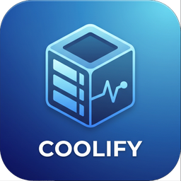

<div align="center">



# Coolify Monitor

Monitor a self-hosted [Coolify](https://coolify.io/) instance from Home Assistant — servers, applications,
databases, teams and services, auto-discovered through Coolify's own REST API and exposed as entities you
choose.

[![GitHub Release][releases-shield]][releases]
[![GitHub Activity][commits-shield]][commits]
[![License][license-shield]](LICENSE)
[![hacs][hacsbadge]][hacs]
![Project Maintenance][maintenance-shield]

</div>

## ✨ Features

- **Easy Setup**: Just your Coolify instance URL and a Read Only API token - no YAML required
- **Auto-Discovery**: Finds every server, application, database, team and service on your instance
- **Selective Monitoring**: Choose exactly which discovered resources become entities, grouped by category
- **Device Grouping**: Each resource becomes its own Home Assistant device (e.g. "Application: recipe-app"),
  so the auto-generated dashboard produces clean, readable cards
- **Reconfigurable**: Change the instance URL or token anytime, or re-run discovery to pick up new resources
- **Options Flow**: Adjust the poll interval or which resources are monitored after setup
- **Reauthentication**: Home Assistant prompts you automatically if your API token is revoked or expires
- **On-Demand Refresh**: A `refresh_data` service action fetches current state immediately, without waiting
  for the next poll

**This integration sets up the following platforms.**

| Platform        | Description                                                                     |
| --------------- | ------------------------------------------------------------------------------- |
| `sensor`        | Description, health, resource type, server links and other details per resource |
| `binary_sensor` | Reachability, usability, and running/healthy status per resource                |

## 🚀 Quick Start

### Step 1: Install the Integration

**Prerequisites:** This integration requires [HACS](https://hacs.xyz/) (Home Assistant Community Store) to be installed.

Click the button below to open the integration directly in HACS:

[](https://my.home-assistant.io/redirect/hacs_repository/?owner=Jings&repository=hass-coolify-monitor&category=integration)

Then:

1. Click "Download" to install the integration
2. **Restart Home Assistant** (required after installation)

> [!NOTE]
> The My Home Assistant redirect will first take you to a landing page. Click the button there to open your Home Assistant instance.

<details>
<summary><strong>Manual Installation (Advanced)</strong></summary>

If you prefer not to use HACS:

1. Download the `custom_components/coolify_monitor/` folder from this repository
2. Copy it to your Home Assistant's `custom_components/` directory
3. Restart Home Assistant

</details>

### Step 2: Create a Coolify API Token

In your Coolify instance, go to **Keys & Tokens** → **API tokens** and create a new token. Give it the
**Read Only** ability - this integration only ever reads data, it never deploys or restarts anything.

### Step 3: Add and Configure the Integration

**Important:** You must have installed the integration first (see Step 1) and restarted Home Assistant!

#### Option 1: One-Click Setup (Quick)

Click the button below to open the configuration dialog:

[](https://my.home-assistant.io/redirect/config_flow_start/?domain=coolify_monitor)

Follow the setup wizard:

1. Enter your Coolify instance URL (e.g. `https://coolify.example.com`) and the API token from Step 2
2. Review the auto-discovery summary ("Found 1 server, 4 applications, 2 databases...")
3. Choose which discovered resources you want entities for, grouped by category
4. Click Submit

#### Option 2: Manual Configuration

1. Go to **Settings** → **Devices & Services**
2. Click **"+ Add Integration"**
3. Search for "Coolify Monitor"
4. Follow the same setup steps as Option 1

### Step 4: Adjust Settings (Optional)

After setup, you can adjust options anytime:

1. Go to **Settings** → **Devices & Services**
2. Find **Coolify Monitor**
3. Click **Configure** to adjust:
   - **Update interval** - how often to poll Coolify (1-1440 minutes, default 60)
   - **Resources** - re-run discovery and change which resources have entities

You can also **Reconfigure** the instance URL or API token anytime without removing the integration.

### Step 5: Start Using!

The integration creates one device per monitored resource, with entities such as:

- **Sensors**: Description, health, Coolify version (host server only), database/service type, and which
  server an application, database or service runs on
- **Binary Sensors**: Reachable/usable (servers), running (applications, databases, services), personal
  team (teams)

Find all entities in **Settings** → **Devices & Services** → **Coolify Monitor** → click on a device.

## 🧩 Available Entities

Entities are only created for resources you selected during setup or in the options flow.

### Servers

- **Reachable** (binary_sensor): Whether Coolify can reach the server
- **Usable** (binary_sensor, diagnostic): Whether the server is usable
- **Description** (sensor, diagnostic)
- **Coolify version** (sensor, diagnostic): Only populated for the server Coolify itself runs on

### Applications

- **Running** (binary_sensor): On when the application's state is `running`
- **Description**, **Name**, **Git branch**, **Health**, **Server** (sensor, diagnostic)
- **URL** (sensor): The application's public FQDN

### Databases

- **Running** (binary_sensor): On when the database's state is `running`
- **Description**, **Health**, **Database type**, **Image**, **Server** (sensor, diagnostic)

### Teams

- **Personal team** (binary_sensor, diagnostic): On for a personal team, off for a shared team
- **Description**, **Timestamp** (creation date, sensor, diagnostic)

### Services

- **Running** (binary_sensor): On when the service's state is `running`
- **Description**, **Service type**, **Health**, **Server** (sensor, diagnostic)

## ⚙️ Service Actions

### `coolify_monitor.refresh_data`

Fetch the current Coolify state immediately instead of waiting for the next poll.

**Example:**

```yaml
action: coolify_monitor.refresh_data
data:
  config_entry_id: 01JG3T2Q6Z9K4V8P0N5R7X2M1A
```

The action returns `refreshed_at`, `success` and `value_count`, so an automation can react to whether the
refresh actually produced data.

## 🔧 Configuration Options

### During Setup

| Name         | Required | Description                                                           |
| ------------ | -------- | --------------------------------------------------------------------- |
| Instance URL | Yes      | Your Coolify instance's address, including the scheme (http or https) |
| API token    | Yes      | A Read Only API token, created in Coolify under Keys & Tokens         |

### After Setup (Options)

You can change these anytime by clicking **Configure**:

| Name            | Default | Description                                               |
| --------------- | ------- | --------------------------------------------------------- |
| Update interval | 60 min  | How often to poll Coolify (1-1440 minutes)                |
| Resources       | -       | Re-run discovery and change which resources are monitored |

## 🛠️ Troubleshooting

### Authentication Issues

#### Reauthentication

If your API token expires or is revoked, Home Assistant will automatically prompt you to reauthenticate:

1. Go to **Settings** → **Devices & Services**
2. Look for an **"Action Required"** or **"Reauthenticate"** message on the integration
3. Click it and enter a new API token
4. Click Submit

The integration will automatically resume normal operation with the new token.

#### Manual Credential Update

You can also update the URL or token at any time without waiting for an error:

1. Go to **Settings** → **Devices & Services**
2. Find **Coolify Monitor**
3. Click the **3 dots menu** → **Reconfigure**
4. Enter the new URL and/or token
5. Click Submit

#### Connection Status

Monitor a server's connection status with its **Reachable** binary sensor - on means Coolify can reach that
server, off means it can't.

### Enable Debug Logging

To enable debug logging for this integration, add the following to your `configuration.yaml`:

```yaml
logger:
  default: info
  logs:
    custom_components.coolify_monitor: debug
```

### Common Issues

#### Authentication Errors

If setup fails with "The API token is invalid or has been revoked":

1. Verify the token was copied correctly, with no leading/trailing whitespace
2. Check the token wasn't revoked in Coolify under Keys & Tokens
3. Confirm the token has at least the Read Only ability

#### Discovery Fails

If setup or the options flow aborts with "Could not fetch the current resources":

1. Verify the instance URL is reachable from Home Assistant (same network, correct scheme)
2. Check the Coolify instance itself is up
3. Check the integration diagnostics (Settings → Devices & Services → Coolify Monitor → 3 dots → Download diagnostics)

## 🤝 Contributing

Contributions are welcome! Please open an issue or pull request if you have suggestions or improvements. See
[CONTRIBUTING.md](CONTRIBUTING.md) for how to set up a development environment (GitHub Codespaces or a local
VS Code devcontainer are both supported) and submit changes.

---

## 📄 License

This project is licensed under the MIT License - see the [LICENSE](LICENSE) file for details.

---

**Made with ❤️ by [@Jings][user_profile]**

---

[commits-shield]: https://img.shields.io/github/commit-activity/y/Jings/hass-coolify-monitor.svg?style=for-the-badge
[commits]: https://github.com/Jings/hass-coolify-monitor/commits/main
[hacs]: https://github.com/hacs/integration
[hacsbadge]: https://img.shields.io/badge/HACS-Default-orange.svg?style=for-the-badge
[license-shield]: https://img.shields.io/github/license/Jings/hass-coolify-monitor.svg?style=for-the-badge
[maintenance-shield]: https://img.shields.io/badge/maintainer-%40Jings-blue.svg?style=for-the-badge
[releases-shield]: https://img.shields.io/github/release/Jings/hass-coolify-monitor.svg?style=for-the-badge
[releases]: https://github.com/Jings/hass-coolify-monitor/releases
[user_profile]: https://github.com/Jings
